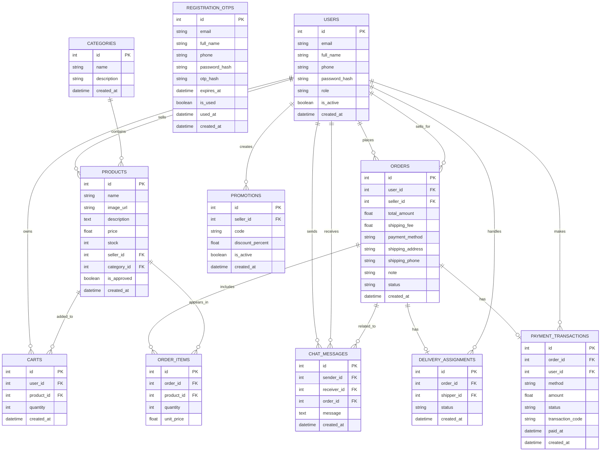

# Cơ Sở Dữ Liệu SmartVision Shop

Sơ đồ dưới đây được dựng từ `backend/app/models.py` và các migration hiện có.

## Ghi chú nhanh

- `orders.user_id` là người mua, `orders.seller_id` là người bán.
- `delivery_assignments.order_id` và `payment_transactions.order_id` là duy nhất nên mỗi đơn hàng chỉ có tối đa một bản ghi tương ứng.
- `registration_otps` là bảng tạm phục vụ đăng ký, không liên kết khóa ngoại với các bảng còn lại.